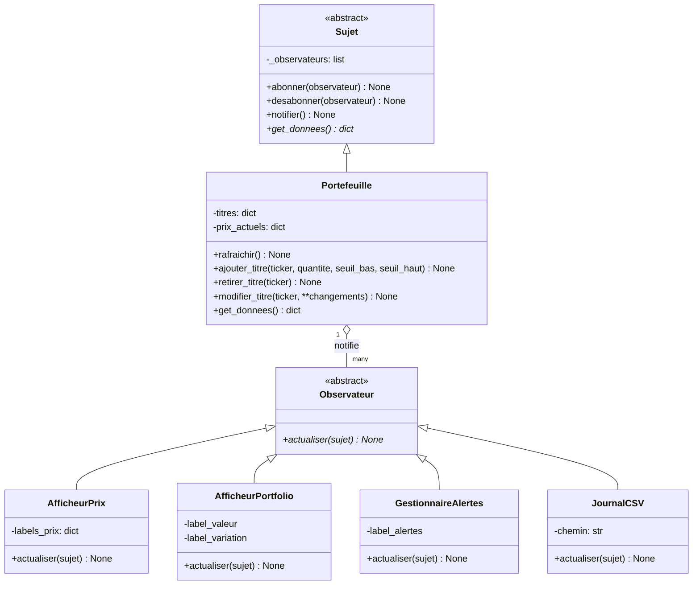

```mermaid
classDiagram
    class Sujet {
        <<abstract>>
        -_observateurs: list
        +abonner(observateur) None
        +desabonner(observateur) None
        +notifier() None
        +get_donnees()* dict
    }

    class Observateur {
        <<abstract>>
        +actualiser(sujet)* None
    }

    class Portefeuille {
        -titres: dict
        -prix_actuels: dict
        +rafraichir() None
        +ajouter_titre(ticker, quantite, seuil_bas, seuil_haut) None
        +retirer_titre(ticker) None
        +modifier_titre(ticker, **changements) None
        +get_donnees() dict
    }

    class AfficheurPrix {
        -labels_prix: dict
        +actualiser(sujet) None
    }

    class AfficheurPortfolio {
        -label_valeur
        -label_variation
        +actualiser(sujet) None
    }

    class GestionnaireAlertes {
        -label_alertes
        +actualiser(sujet) None
    }

    class JournalCSV {
        -chemin: str
        +actualiser(sujet) None
    }


    Sujet <|-- Portefeuille
    Observateur <|-- AfficheurPrix
    Observateur <|-- AfficheurPortfolio
    Observateur <|-- GestionnaireAlertes
    Observateur <|-- JournalCSV

    Portefeuille "1" o-- "many" Observateur : notifie
```
  
