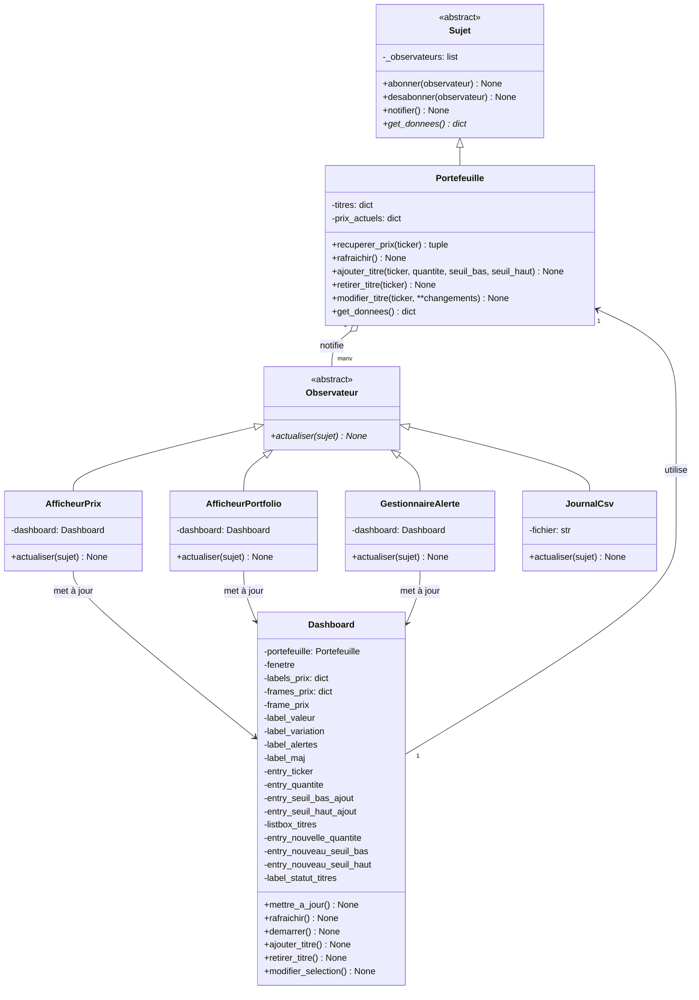

```mermaid
classDiagram
    class Sujet {
        <<abstract>>
        -_observateurs: list
        +abonner(observateur) None
        +desabonner(observateur) None
        +notifier() None
        +get_donnees()* dict
    }

    class Observateur {
        <<abstract>>
        +actualiser(sujet)* None
    }

    class Portefeuille {
        -titres: dict
        -prix_actuels: dict
        +recuperer_prix(ticker) tuple
        +rafraichir() None
        +ajouter_titre(ticker, quantite, seuil_bas, seuil_haut) None
        +retirer_titre(ticker) None
        +modifier_titre(ticker, **changements) None
        +get_donnees() dict
    }

    class AfficheurPrix {
        -dashboard: Dashboard
        +actualiser(sujet) None
    }

    class AfficheurPortfolio {
        -dashboard: Dashboard
        +actualiser(sujet) None
    }

    class GestionnaireAlerte {
        -dashboard: Dashboard
        +actualiser(sujet) None
    }

    class JournalCsv {
        -fichier: str
        +actualiser(sujet) None
    }

    class Dashboard {
        -portefeuille: Portefeuille
        -fenetre
        -labels_prix: dict
        -frames_prix: dict
        -frame_prix
        -label_valeur
        -label_variation
        -label_alertes
        -label_maj
        -entry_ticker
        -entry_quantite
        -entry_seuil_bas_ajout
        -entry_seuil_haut_ajout
        -listbox_titres
        -entry_nouvelle_quantite
        -entry_nouveau_seuil_bas
        -entry_nouveau_seuil_haut
        -label_statut_titres
        +mettre_a_jour() None
        +rafraichir() None
        +demarrer() None
        +ajouter_titre() None
        +retirer_titre() None
        +modifier_selection() None
    }

    Sujet <|-- Portefeuille
    Observateur <|-- AfficheurPrix
    Observateur <|-- AfficheurPortfolio
    Observateur <|-- GestionnaireAlerte
    Observateur <|-- JournalCsv

    Portefeuille "1" o-- "many" Observateur : notifie
    Dashboard "1" --> "1" Portefeuille : utilise
    AfficheurPrix --> Dashboard : met à jour
    AfficheurPortfolio --> Dashboard : met à jour
    GestionnaireAlerte --> Dashboard : met à jour
```
  
